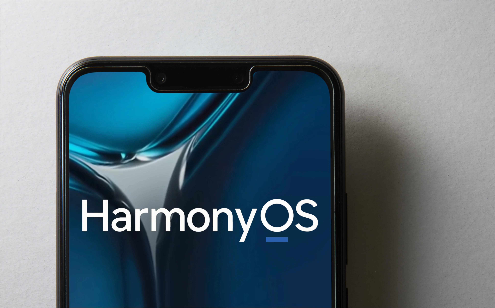

# Japalura 🦎

### About me
This is a fantastic application for Image Processing
- Based on image encoding and decoding, implement image editing, including cropping, rotation, color gamut adjustment (Only brightness, transparency, saturation) and other functions

### Constraints and Limitations

- Only supports running on standard systems and supports devices such as Huawei phones or Huawei phone device emulators running on DevEco Studio
- Stage model, supports API version 9
- Need to compile and run on DevEco Studio 3.1 Release version

### Related Permissions

- ohos.permission.MEDIA_LOCATION
- ohos.permission.READ_MEDIA
- ohos.permission.WRITE_MEDIA

### Instructions for use

- Click the button to cut and adjust according to personal needs
- After completion, you can save the image as needed

### Reference Material

- [Image Decoding](https://developer.harmonyos.com/cn/docs/documentation/doc-references-V3/js-apis-image-0000001477981401-V3#ZH-CN_TOPIC_0000001523648994__imagesource):Read image files in different formats, decode them uncompressed into bitmap format
- [PixelMap](https://developer.harmonyos.com/cn/docs/documentation/doc-references-V3/js-apis-image-0000001477981401-V3#ZH-CN_TOPIC_0000001523648994__pixelmap7):The decoded state of an image, used for processing image pixels
- [Image Encoding](https://developer.harmonyos.com/cn/docs/documentation/doc-references-V3/js-apis-image-0000001477981401-V3#ZH-CN_TOPIC_0000001523648994__imagepacker):After completing pixel processing, the image needs to be re encoded and packaged to generate the desired image format
